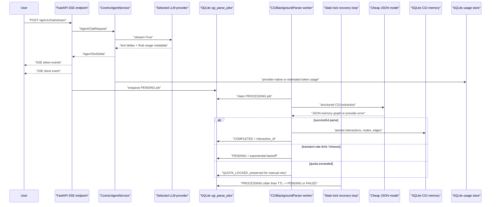

# Cosmic Agent

Cosmic Agent is an open-source AI agent that unifies a CGI memory graph with a
multi-provider LLM runtime. It supports OpenAI, Anthropic, Google, and a Codex
OAuth-backed boundary, streams responses over Server-Sent Events, and stores
CGI memory through a durable background queue after the user-visible answer has
finished.

The project is intentionally split by responsibility:

```text
app/api         FastAPI routers, SSE, dashboard REST APIs
app/agent       LLM orchestration, provider runtime adapters, persona flow
app/core        CGI memory schema, graph-domain storage, MCP context boundary
app/config      environment settings, encrypted SQLite overrides, model routes
app/auth        Codex OAuth client boundary
app/interfaces  Rich CLI and future Telegram/Web interface adapters
dashboard       Vite + React dashboard frontend
```

## Architecture

The important latency trick is that the answer path and CGI parsing path are
separate. The API streams text first; only after the stream completes does it
enqueue a durable parse job. A worker claims due jobs, asks a cheaper
JSON-focused model to extract memory nodes, and marks quota failures as
`QUOTA_LOCKED` instead of blindly retrying. A startup recovery loop also
rescues zombie jobs stuck in `PROCESSING` after a crash.



## Features

- Multi-provider LLM selection through a registry-based provider factory.
- Live response streaming through FastAPI `StreamingResponse` and SSE.
- Background CGI memory parsing after the stream completes.
- Durable SQLite background job queue with smart retry and quota locking.
- Stale lock recovery for zombie `PROCESSING` jobs after worker crashes.
- Runtime settings and model aliases through SQLite overrides.
- Dashboard-ready REST APIs for provider status, prompts, and CGI node CRUD.
- Provider-native streaming token usage capture with local estimate fallback.
- Vite + React dashboard with streaming chat and job monitor panels.
- MCP context bridge for local folders plus STDIO and HTTP/SSE JSON-RPC servers.
- Rich-based CLI interface using the same agent service as the web API.
- Docker, Docker Compose, and GitHub Actions CI setup.

## Quick start

Use Python 3.10+.

```bash
python3 -m venv .venv
. .venv/bin/activate
pip install -e ".[dev]"
cp .env.example .env
```

Edit `.env` and add at least one provider key. Then run the API:

```bash
uvicorn app.main:app --host 0.0.0.0 --port 8000
```

Open the OpenAPI UI at <http://localhost:8000/docs>.

Run the dashboard in another shell:

```bash
cd dashboard
npm install
npm run dev
```

Open the dashboard at <http://localhost:5173>. The Vite dev server proxies
`/api` calls to the FastAPI server.

Run the CLI:

```bash
cosmic-agent --provider openai --model gpt-4o-mini
```

or:

```bash
python -m app.main --mode cli --provider openai --model gpt-4o-mini
```

## Docker Compose

Copy the example environment file first:

```bash
cp .env.example .env
```

Fill in your API keys, then start the service:

```bash
docker compose up --build
```

The API is exposed at <http://localhost:8000> and the dashboard at
<http://localhost:5173>. SQLite runtime settings and CGI memory are stored in
the named Docker volume `cosmic_agent_data`.

## Environment variables

Provider keys:

- `OPENAI_API_KEY`
- `ANTHROPIC_API_KEY`
- `GOOGLE_API_KEY`

Model routing defaults:

- `DEFAULT_PROVIDER`
- `DEFAULT_MODEL`
- `CGI_PARSE_PROVIDER`
- `CGI_PARSE_MODEL`
- `CGI_PARSE_MAX_NODES`
- `CGI_PARSE_JOB_MAX_ATTEMPTS`
- `CGI_PARSE_JOB_RETRY_BASE_SECONDS`
- `CGI_PARSE_JOB_RETRY_MAX_SECONDS`
- `CGI_PARSE_JOB_LIMIT_PER_RUN`
- `CGI_PARSE_STALE_LOCK_SECONDS`
- `CGI_PARSE_RECOVERY_INTERVAL_SECONDS`
- `CGI_PARSE_RECOVERY_BATCH_LIMIT`

Memory pruning and usage:

- `CGI_MEMORY_MAX_INTERACTIONS`
- `CGI_MEMORY_PRUNE_MIN_WEIGHT`
- `USAGE_DB_PATH`
- `LLM_USAGE_INPUT_COST_PER_MILLION`
- `LLM_USAGE_OUTPUT_COST_PER_MILLION`

Storage and security:

- `XDG_DATA_HOME` controls the default SQLite data directory.
- `CONFIG_DB_PATH` overrides the runtime settings database path.
- `CGI_MEMORY_DB_PATH` overrides the CGI memory database path.
- `CONFIG_ENCRYPTION_KEY` enables encrypted API-key overrides in SQLite.
- `COSMIC_AGENT_PORT` and `COSMIC_DASHBOARD_PORT` control local Compose ports.

Generate an encryption key with:

```bash
python -c "from cryptography.fernet import Fernet; print(Fernet.generate_key().decode())"
```

Do not commit `.env` or real keys.

## API overview

Streaming:

- `POST /api/v1/chat/stream`
  - compatibility alias: `POST /api/chat/stream`

Settings and model routing:

- `GET /api/v1/settings`
  - compatibility alias: `GET /api/config`
- `PUT /api/v1/settings/{key}`
- `DELETE /api/v1/settings/{key}`
- `GET /api/v1/model-routes`
- `PUT /api/v1/model-routes/{alias}`
- `DELETE /api/v1/model-routes/{alias}`
- `GET /api/v1/persona`
- `PUT /api/v1/persona`

CGI memory:

- `GET /api/v1/cgi/tree`
  - compatibility alias: `GET /api/memory/nodes`
- `GET /api/v1/cgi/nodes`
- `GET /api/v1/cgi/nodes/{node_id}`
- `PATCH /api/v1/cgi/nodes/{node_id}`
- `DELETE /api/v1/cgi/nodes/{node_id}`
- `POST /api/v1/cgi/prune`
- `GET /api/v1/cgi/pruning-events`

Background jobs:

- `GET /api/v1/jobs`
- `POST /api/v1/jobs/retry`

### Usage and cost dashboard

- `GET /api/v1/usage/today`
  - compatibility alias: `GET /api/usage/today`

Streaming calls record provider-native `prompt_tokens`, `completion_tokens`,
and `total_tokens` when the provider sends usage metadata in the final stream
chunk. If usage is unavailable, Cosmic Agent falls back to local token
estimates. Set `LLM_USAGE_INPUT_COST_PER_MILLION` and
`LLM_USAGE_OUTPUT_COST_PER_MILLION` to convert tracked tokens into dashboard
cost estimates for your active model.

### MCP context boundary

`app/core/mcp_client.py` provides the first MCP-compatible context bridge:
`LocalDirectoryMCPClient` safely exposes text resources under one configured
root, such as an Obsidian vault, and renders selected resources as a prompt
block.

For remote MCP servers, use `RemoteMCPClient` with:

- `StdioMCPTransport` for local subprocess MCP servers.
- `SSEMCPTransport` for HTTP endpoints that return JSON or `text/event-stream`
  JSON-RPC responses.

The remote client can list tools/resources, call tools, read resources, and
render tool/resource results into the same prompt context bundle used by the
agent layer.

`app/agent/mcp_tooling.py` converts MCP `tools/list` responses into
provider-native function/tool schemas for OpenAI-compatible chat completions,
Anthropic Messages, and Google Gen AI. The main chat service now performs the
orchestration pass: list MCP tools, let the selected model request tool calls,
execute those MCP tools, inject the `<mcp_context>` result, and stream the final
answer.

### Chat sessions and dashboard restore

Dashboard chat sessions are persisted in SQLite through
`SQLiteChatHistoryStore`. The React dashboard stores a stable `session_id` in
`localStorage`, restores prior user/assistant bubbles on page load, and can also
deep-link a session with `?session_id=<id>`.

The restore API is:

- `GET /api/v1/chat/history/{session_id}`

It returns both the visible chat history and the session-scoped CGI memory tree.

## Development checks

```bash
PYTHONPYCACHEPREFIX=/private/tmp/cosmic-agent-pycache python3 -m compileall app
pytest -q
ruff check app
ruff format --check app
cd dashboard && npm run build
```

## Security notes

- Set `FRONTEND_API_SECRET` to require `X-Cosmic-API-Key` or
  `Authorization: Bearer <secret>` on every `/api/*` request.
- `API_RATE_LIMIT_PER_MINUTE` enables a lightweight in-process IP rate limit
  for `/api/*` routes. Use a real edge proxy or distributed limiter for
  multi-process public deployments.
- API keys are read from environment variables. Dashboard API-key overrides are
  encrypted only when `CONFIG_ENCRYPTION_KEY` is configured.
- The REST responses expose secret status only; they do not return key values.

## Project status

Phases 1 through 8 are complete:

1. Architecture and directory structure
2. Dynamic settings and provider factory
3. SSE streaming plus post-stream CGI parsing
4. CLI and dashboard REST APIs
5. README, environment example, Dockerfile, and Docker Compose service
6. Durable CGI parse queue, smart retry/quota lock, provider-native usage
   capture, CI pipeline, and MCP context skeleton
7. Stale lock recovery, Vite + React dashboard, dashboard Compose service, and
   STDIO/HTTP-SSE MCP client transports
8. MCP function/tool-call orchestration, dashboard session restore, and basic
   API-key/rate-limit protection
