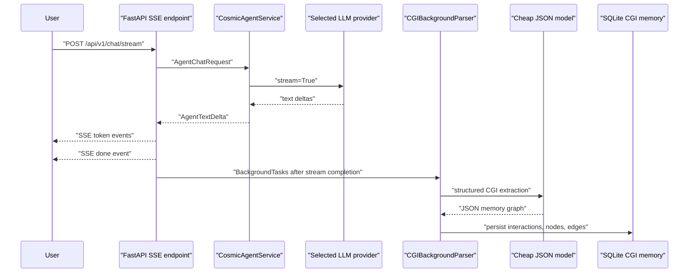

# Cosmic Agent

Cosmic Agent is an open-source AI agent that unifies a CGI memory graph with a
multi-provider LLM runtime. It supports OpenAI, Anthropic, Google, and a Codex
OAuth-backed boundary, streams responses over Server-Sent Events, and stores
CGI memory in the background after the user-visible answer has finished.

The project is intentionally split by responsibility:

```text
app/api         FastAPI routers, SSE, dashboard REST APIs
app/agent       LLM orchestration, provider runtime adapters, persona flow
app/core        CGI memory schema, graph-domain storage, provider-free logic
app/config      environment settings, encrypted SQLite overrides, model routes
app/auth        Codex OAuth client boundary
app/interfaces  Rich CLI and future Telegram/Web interface adapters
dashboard       future frontend application
```

## Architecture

The important latency trick is that the answer path and CGI parsing path are
separate. The API streams text first; only after the stream completes does the
background parser ask a cheaper JSON-focused model to extract memory nodes.



## Features

- Multi-provider LLM selection through a registry-based provider factory.
- Live response streaming through FastAPI `StreamingResponse` and SSE.
- Background CGI memory parsing after the stream completes.
- Runtime settings and model aliases through SQLite overrides.
- Dashboard-ready REST APIs for provider status, prompts, and CGI node CRUD.
- Rich-based CLI interface using the same agent service as the web API.
- Docker and Docker Compose setup for one-command local deployment.

## Quick start

Use Python 3.10+.

```bash
python3 -m venv .venv
. .venv/bin/activate
pip install -e ".[dev]"
cp .env.example .env
```

Edit `.env` and add at least one provider key. Then run the API:

```bash
uvicorn app.api.application:app --host 0.0.0.0 --port 8000
```

Open the OpenAPI UI at <http://localhost:8000/docs>.

Run the CLI:

```bash
cosmic-agent --provider openai --model gpt-4o-mini
```

or:

```bash
python -m app.interfaces --provider openai --model gpt-4o-mini
```

## Docker Compose

Copy the example environment file first:

```bash
cp .env.example .env
```

Fill in your API keys, then start the service:

```bash
docker compose up --build
```

The API is exposed at <http://localhost:8000>. SQLite runtime settings and CGI
memory are stored in the named Docker volume `cosmic_agent_data`.

## Environment variables

Provider keys:

- `OPENAI_API_KEY`
- `ANTHROPIC_API_KEY`
- `GOOGLE_API_KEY`

Model routing defaults:

- `DEFAULT_PROVIDER`
- `DEFAULT_MODEL`
- `CGI_PARSE_PROVIDER`
- `CGI_PARSE_MODEL`
- `CGI_PARSE_MAX_NODES`

Storage and security:

- `XDG_DATA_HOME` controls the default SQLite data directory.
- `CONFIG_DB_PATH` overrides the runtime settings database path.
- `CGI_MEMORY_DB_PATH` overrides the CGI memory database path.
- `CONFIG_ENCRYPTION_KEY` enables encrypted API-key overrides in SQLite.

Generate an encryption key with:

```bash
python -c "from cryptography.fernet import Fernet; print(Fernet.generate_key().decode())"
```

Do not commit `.env` or real keys.

## API overview

Streaming:

- `POST /api/v1/chat/stream`

Settings and model routing:

- `GET /api/v1/settings`
- `PUT /api/v1/settings/{key}`
- `DELETE /api/v1/settings/{key}`
- `GET /api/v1/model-routes`
- `PUT /api/v1/model-routes/{alias}`
- `DELETE /api/v1/model-routes/{alias}`
- `GET /api/v1/persona`
- `PUT /api/v1/persona`

CGI memory:

- `GET /api/v1/cgi/tree`
- `GET /api/v1/cgi/nodes`
- `GET /api/v1/cgi/nodes/{node_id}`
- `PATCH /api/v1/cgi/nodes/{node_id}`
- `DELETE /api/v1/cgi/nodes/{node_id}`

## Development checks

```bash
PYTHONPYCACHEPREFIX=/private/tmp/cosmic-agent-pycache python3 -m compileall app
pytest -q
ruff check app
ruff format --check app
```

## Security notes

- The dashboard APIs currently assume a trusted local deployment. Add
  authentication, authorization, CSRF protection, and rate limiting before
  exposing them publicly.
- API keys are read from environment variables. Dashboard API-key overrides are
  encrypted only when `CONFIG_ENCRYPTION_KEY` is configured.
- The REST responses expose secret status only; they do not return key values.

## Project status

Phases 1 through 5 are complete:

1. Architecture and directory structure
2. Dynamic settings and provider factory
3. SSE streaming plus post-stream CGI parsing
4. CLI and dashboard REST APIs
5. README, environment example, Dockerfile, and Docker Compose service
